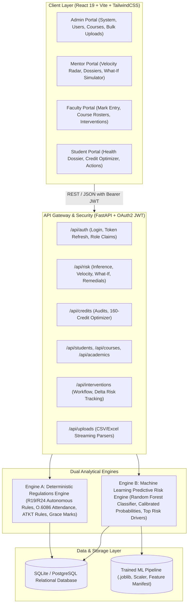
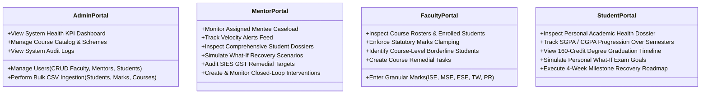

# AcademiQ — AI-Powered Credit & Dropout Evaluation and Prevention Platform
## Comprehensive Technical, Architectural & Functional Report

---

## 1. Executive Summary & Problem Statement

### 1.1 Project Overview
**AcademiQ** is an enterprise-grade academic analytics and early-intervention platform designed specifically to combat student dropout, credit stagnation, and academic failure in higher engineering education. Grounded in the **SIES Graduate School of Technology (SIES GST) Autonomous Academic Regulations (R19 / R24)** and Mumbai University statutory ordinances, AcademiQ transforms academic monitoring from passive grade bookkeeping into an active, prescriptive recovery engine.

### 1.2 The Problem
In standard university environments, academic distress is typically identified only **after** semester-end examinations have concluded, results are published, and a student has already accumulated critical backlogs or received an academic Year Down (detention). Traditional college Enterprise Resource Planning (ERP) systems act merely as administrative repositories for attendance rolls and grade ledgers without providing:
1. **Predictive Foresight**: Early probability scores warning faculty weeks before examinations.
2. **Explainable Causality**: Root-cause analysis identifying *why* a student is sliding (e.g., theory exam failures vs. practical attendance deficits).
3. **Prescriptive Guidance**: Clear, calculable minimum performance thresholds required to clear semester heads under autonomous regulations.
4. **Graduation Credit Pacing**: Dynamic credit clearance pathways ensuring students do not exceed statutory semester overload caps while clearing backlogs.

### 1.3 Core Innovation: The Closed-Loop Intervention Paradigm
Unlike traditional software, AcademiQ operates on an autonomous **7-step closed-loop lifecycle**:
$$\text{Data Ingestion} \longrightarrow \text{Predictive Risk} \longrightarrow \text{Explainability} \longrightarrow \text{Statutory Audit} \longrightarrow \text{Counterfactual Simulation} \longrightarrow \text{Intervention Assignment} \longrightarrow \text{Efficacy Tracking } (\Delta\text{Risk})$$

---

## 2. High-Level System Architecture

AcademiQ is built on a decoupled, service-oriented architecture separating high-throughput REST APIs, dual-engine analytical processing, and an interactive modern web frontend.



---

## 3. The Dual Analytical Engines

A critical design requirement of AcademiQ is the **separation of statutory university law from statistical machine learning**. The system utilizes two complementary engines:

### 3.1 Engine A: Deterministic Academic Regulations Engine
Engine A implements statutory university ordinances as deterministic, immutable code. **Engine B (ML) never overrides Engine A**.

* **Statutory Framework**: SIES GST Autonomous Regulations (R19 / R24) aligned with Mumbai University and AICTE norms.
* **Evaluation Head Splitting**:
  - Total Course Score: 100 Marks.
  - In-Semester Evaluation (ISE): 20 Marks ($\text{cap} = 20$).
  - Mid-Semester Examination (MSE): 20 Marks ($\text{cap} = 20$).
  - End-Semester Examination (ESE): 60 Marks ($\text{cap} = 60$).
  - Term Work (TW): 25 Marks ($\text{cap} = 25$).
  - Practical & Oral (PR/OR): 25 Marks ($\text{cap} = 25$).
* **Separate Head of Passing Rule**:
  - A student must obtain $\ge 40\%$ aggregate ($\ge 40/100$) **and** must satisfy the statutory passing head for ESE theory:
    $$\text{ESE Score} \ge 24 / 60 \quad (40\%)$$
    Even if internal marks ($\text{ISE} + \text{MSE}$) are high, failing ESE results in course failure.
* **Attendance Ordinances (Mumbai University Ordinance 6086)**:
  - $\ge 75\%$: **Eligible** for semester examinations.
  - $50\% - 74.9\%$: **Condonation Zone** (Requires medical certificate and Principal approval).
  - $< 50\%$: **Definitive Detention** (Student debarred from appearing in end-semester examinations).
* **ATKT Progression (Allowed To Keep Terms)**:
  - Maximum 8 total failed heads per academic year.
  - Maximum 5 failed ESE theory heads allowed to carry forward.
  - Mandatory 100% clearance of First Year (FE) before entering Semester 5 (Third Year).
  - Mandatory 100% clearance of Second Year (SE) before entering Semester 7 (Final Year).
* **Grace Marks (Ordinance 5042)**:
  - Automatic evaluation of 1–2 grace marks on borderline ESE heads ($22/60$ or $23/60$) if the aggregate reaches $40\%$.

### 3.2 Engine B: Machine Learning Predictive Risk Engine
Engine B predicts the statistical probability of a student failing or dropping out based on historical training patterns across multi-year cohorts.

#### Model Benchmarking & Selection
Trained offline on higher education academic datasets and evaluated across cross-validation splits:

| Model Architecture | Accuracy | Precision | Recall | F1-Score | ROC AUC | Selection Status |
| :--- | :---: | :---: | :---: | :---: | :---: | :---: |
| **Random Forest** | **87.13%** | **87.05%** | **78.87%** | **82.76%** | **0.9175** | **Selected Production Model** |
| XGBoost Classifier | 86.95% | 85.86% | 79.81% | 82.73% | 0.9174 | Candidate |
| Logistic Regression | 85.66% | 84.97% | 77.00% | 80.79% | 0.9058 | Baseline |

#### Feature Vector & Preprocessing
The model ingests 5 standardized, scaled features extracted from academic progression:
1. `attendance` (Aggregated percentage across all current courses, $0 - 100\%$)
2. `marks` (Normalized aggregate score across internal evaluations, $0 - 100\%$)
3. `gpa` (Current Cumulative Grade Point Average, scale $0 - 10$)
4. `assignment_completion` (Ratio of submitted to assigned deliverables, $0 - 100\%$)
5. `failed_subjects` (Count of uncleared backlog heads)

#### Risk Stratification Tiers
| Tier | Probability Range | System Action |
| :--- | :---: | :--- |
| **LOW** | $0.00 - 0.29$ | Standard academic progression monitoring. |
| **MEDIUM** | $0.30 - 0.59$ | Mentorship alert, Velocity Radar tracking, optional peer tutoring. |
| **HIGH** | $0.60 - 0.79$ | Mandatory mentor counseling, What-If recovery contract, parent notification. |
| **CRITICAL** | $0.80 - 1.00$ | Statutory intervention panel, HOD review, remedial class enforcement. |

#### Feature Attribution & Explainability
For every prediction, the engine computes normalized feature weights to present plain-English root causes on dashboards (e.g., *"Attendance below mandatory 75% threshold (58.4%)"* or *"SGPA declined by 1.8 points between Sem 2 and Sem 3"*), avoiding black-box ambiguity.

---

## 4. Advanced Prescriptive & Remediation Subsystems

AcademiQ moves beyond reporting into concrete academic remediation:

### 4.1 2026 Counterfactual "What-If" Recovery Simulator
* **Purpose**: Allows students and mentors to dynamically answer: *"What specific scores must be achieved to move from High Risk to Low Risk?"*
* **Dynamic Sliders**:
  - Target Attendance ($50\% - 100\%$)
  - Internal & Termwork Target ($40\% - 100\%$)
  - Lab/Assignment Completion ($50\% - 100\%$)
  - Target ESE Exam Score ($24 - 60$ marks out of 60)
* **Real-Time Projection**: Instantly recalculates predicted risk probability and visualizes the risk delta ($\Delta\text{Risk} = \text{Current Risk} - \text{Simulated Risk}$).
* **Goal Commitment**: Mentors or students can convert simulated targets into a binding **Personalized Academic Recovery Contract** stored directly in the database.

### 4.2 Statutory Remedial Target Calculator
* **Purpose**: Computes the exact passing threshold per subject based on already accumulated internal marks.
* **Formula**:
  $$\text{Required ESE Score} = \max\left(24, 40 - (\text{ISE} + \text{MSE})\right)$$
  The system accounts for the mandatory $24/60$ separate passing head rule. Even if $\text{ISE} + \text{MSE} = 38/40$, the student is informed that they still require at least $24/60$ in the ESE theory exam.

### 4.3 Degree Graduation Credit Pathway Optimizer
* **Degree Target**: 160 Credits for 4-year B.Tech (120 credits for Direct Second Year Lateral Entry).
* **Statutory Constraint**: Maximum permissible semester load cap of **28 credits per semester**.
* **Algorithm**:
  1. Computes total earned credits and identifies outstanding backlog credits.
  2. Projects future regular semesters up to Semester 8 (standard graduation).
  3. Allocates regular course credits while dynamically packing backlog re-registrations into upcoming semesters without exceeding the 28-credit ceiling.
  4. Outputs feasibility status:
     - `ON_TIME_FEASIBLE`: Graduation feasible within the standard 8 semesters.
     - `AT_RISK_PACING`: Heavily loaded semesters requiring strict academic discipline.
     - `DELAYED_GRADUATION`: Overload exceeds statutory limits, recommending summer terms or an additional remedial semester.

### 4.4 Proactive Early-Warning Velocity Radar
* **Purpose**: Identifies students with steep downward momentum who have not yet crossed official failure thresholds.
* **Computation**: Evaluates first-order derivatives across consecutive weeks:
  $$\text{Velocity}_{\text{Att}} = \frac{\Delta\text{Attendance}}{\Delta t}, \quad \text{Velocity}_{\text{Marks}} = \frac{\Delta\text{Marks}}{\Delta t}$$
* **Benefit**: Catches students in Week 4–6 when there is still 6–8 weeks to reverse academic decline before semester-end finals.

### 4.5 Closed-Loop Efficacy Tracking ($\Delta\text{Risk}$) & AI Recovery Milestones
* **Tracking**: When an intervention is assigned, the system records `baseline_risk_prob`. Upon subsequent updates, it measures:
  $$\Delta\text{Risk} = \text{Baseline Risk} - \text{Current Risk}$$
  Categorized as `RESOLVED`, `IMPROVING`, `STAGNANT`, or `ESCALATING`.
* **Actionable Roadmap**: Automatically synthesizes a 4-week structured milestone roadmap (e.g., Week 1: Concept revision; Week 2: Quiz re-attempt; Week 3: Lab clearance; Week 4: Prelim mock exam) and pre-drafts mentor outreach messages.

---

## 5. Role-Based Capabilities & Workflows

AcademiQ enforces strict Role-Based Access Control (RBAC) across 4 dedicated user portals:



### 5.1 Admin Role
* **System Metrics Dashboard**: Real-time cohort risk distributions, department-wise risk breakdown, and intervention completion rates.
* **User Management**: Creation, updating, role assignment, and deactivation for all faculty, mentors, and students.
* **Curriculum Management**: Maintaining course codes, titles, credit weights, semester mappings, and faculty teaching assignments.
* **Bulk Ingestion Pipeline**: High-volume asynchronous CSV upload parsers with format validation, schema error checks, and atomic database commits.

### 5.2 Mentor Role
* **Caseload Overview**: Immediate view of assigned mentees sorted by risk severity and credit deficits.
* **Velocity Radar Feed**: Priority alerts identifying mentees with negative momentum.
* **Deep-Dive Dossier**: Comprehensive multi-tab student profile including SGPA progression charts, individual course grades, attendance percentages, and AI risk drivers.
* **Remediation & Simulation**: Interactive What-If Simulator with goal-locking capabilities and autonomous remedial target breakdowns.
* **Intervention Tracking**: Creation, delegation, deadline management, and $\Delta\text{Risk}$ efficacy evaluation.

### 5.3 Faculty Role
* **Course Roster Analytics**: Real-time pass/fail ratios, attendance distributions, and average class performance.
* **Granular Marks Entry**: Streamlined grading interface supporting all statutory evaluation heads ($\text{ISE} \le 20$, $\text{MSE} \le 20$, $\text{ESE} \le 60$, $\text{TW} \le 25$, $\text{PR} \le 25$) with strict boundary enforcement.
* **Early Course Warnings**: Instant flagging of students failing internal assessments before the End-Semester Examination.

### 5.4 Student Role
* **Private Academic Dossier**: Transparent, stigma-free visualization of own academic standing, CGPA, and earned credits.
* **Graduation Optimizer Timeline**: Clear semester-by-semester view of remaining degree requirements and backlog clearance milestones.
* **Self-Directed Simulator**: Empowering students to experiment with goal-setting (e.g., *"If I score 42 in ESE theory, my risk drops to 18%"*).
* **Action Roadmap**: Concrete weekly milestones to clear backlogs, improve attendance, and complete pending assignments.

---

## 6. Relational Database Schema & Data Models

The system runs on a relational schema managed via SQLAlchemy ORM with foreign key integrity and indexing:

| Entity Name | Primary Key | Key Attributes | Relational Associations |
| :--- | :--- | :--- | :--- |
| `User` | `id` (Integer) | `email`, `hashed_password`, `full_name`, `role` (Admin/Mentor/Faculty/Student), `is_active` | 1-to-1 with `StudentProfile` (if student) |
| `StudentProfile` | `id` (Integer) | `user_id`, `roll_no`, `department`, `current_semester`, `mentor_id`, `admission_year` | Belongs to `User`, Foreign Key to `mentor_id` (`User`) |
| `Course` | `id` (Integer) | `code`, `name`, `credits`, `semester`, `department`, `scheme` (R19/R24), `faculty_id` | Foreign Key to `faculty_id` (`User`) |
| `CourseResult` | `id` (Integer) | `student_id`, `course_id`, `semester`, `ise`, `mse`, `ese`, `tw`, `pr_or`, `total_marks`, `grade`, `grade_point`, `credits_earned`, `status` | Links `StudentProfile` and `Course` |
| `AcademicRecord` | `id` (Integer) | `student_id`, `semester`, `sgpa`, `cgpa`, `attendance_percentage`, `earned_credits`, `total_credits`, `backlog_count` | Belongs to `StudentProfile` |
| `RiskScore` | `id` (Integer) | `student_id`, `risk_probability`, `risk_level`, `top_factors` (JSON), `model_version`, `calculated_at` | Belongs to `StudentProfile` |
| `Intervention` | `id` (Integer) | `student_id`, `assigned_by`, `title`, `description`, `priority`, `status`, `baseline_risk_prob`, `current_risk_prob`, `risk_delta`, `efficacy_status`, `deadline` | Links `StudentProfile`, `User` |
| `UploadLog` | `id` (Integer) | `uploaded_by`, `upload_type`, `filename`, `records_processed`, `status`, `errors` (JSON), `timestamp` | Audit logging for bulk data ingestion |

---

## 7. Security, Quality Assurance & Verification Audit

### 7.1 Security Architecture
* **Authentication**: OAuth2 Password Bearer flow issuing cryptographically signed JWT tokens with configurable expiration.
* **Password Encryption**: Industry-standard `bcrypt` hashing with adaptive salting.
* **Authorization**: Fine-grained dependency-injected RBAC guards on every FastAPI route (preventing students from accessing mentor endpoints or altering marks).
* **Data Sanitization**: Pydantic input schemas strictly validating types, regex patterns, and range constraints ($\text{marks} \ge 0$, $\text{attendance} \le 100\%$).

### 7.2 Verification & Test Results
AcademiQ has undergone exhaustive unit, integration, and end-to-end API auditing:

1. **Automated Backend Pytest Suite**:
   - Status: **34 Passed, 0 Failed**.
   - Test files: `test_auth.py`, `test_credits.py`, `test_interventions.py`, `test_rbac.py`, `test_risk.py`, `test_upload.py`.
2. **Comprehensive Multi-Role API Audit**:
   - Status: **38/38 Endpoints Verified 100% Healthy (200 OK)** across all 4 roles.
   - Tested workflows: Admin analytics, Mentor velocity feeds, What-If simulation, statutory remedial targets, faculty mark clamping, and student credit optimization.
3. **Frontend Production Build**:
   - Tool: Vite 8.2 + React 19.
   - Status: **Compiled successfully** with 0 errors across 2,467 modules.

---

## 8. Deployment & Execution Guide

### 8.1 Prerequisites
* **Python**: 3.10+ (with virtual environment)
* **Node.js**: v18+ & npm
* **Database**: Pre-seeded SQLite database (`mini_proj.db`) located in `backend/`

### 8.2 Starting the Backend Server
```powershell
cd d:\AI-Credit-Dropout\backend
.\venv\Scripts\Activate.ps1
uvicorn app.main:app --reload --port 8000
```
* **API Documentation (Swagger UI)**: [http://localhost:8000/docs](http://localhost:8000/docs)
* **OpenAPI Schema**: [http://localhost:8000/openapi.json](http://localhost:8000/openapi.json)

### 8.3 Starting the Frontend Server
```powershell
cd d:\AI-Credit-Dropout\frontend
npm run dev
```
* **Web Application Portal**: [http://localhost:5173](http://localhost:5173)

### 8.4 Default Demonstration Accounts

| Role | Username / Email | Password | Primary Accessible Portals |
| :--- | :--- | :--- | :--- |
| **Admin** | `admin@college.edu` | `Demo@1234` | Full system control, user manager, course catalogs, bulk uploads |
| **Mentor** | `mentor1@college.edu` | `Demo@1234` | Mentee caseload, Velocity Radar, What-If simulator, interventions |
| **Faculty** | `faculty1@college.edu` | `Demo@1234` | Course rosters, ISE/MSE/ESE marks entry, course-level risk |
| **Student** | `student003@college.edu` | `Demo@1234` | Personal health dossier, 160-credit graduation timeline, simulator |
| **Student** | `student001@college.edu` | `Demo@1234` | Personal health dossier, credit optimizer, recovery roadmap |

---

## 9. Conclusion & Impact

AcademiQ bridges the critical gap between academic data collection and real-world student recovery. By uniting **autonomous academic regulations (Engine A)**, **calibrated machine learning risk forecasting (Engine B)**, **interactive counterfactual simulation**, and **statutory credit pacing**, AcademiQ provides higher education institutions with a modern, proactive, and mathematically grounded defense against student dropout.
